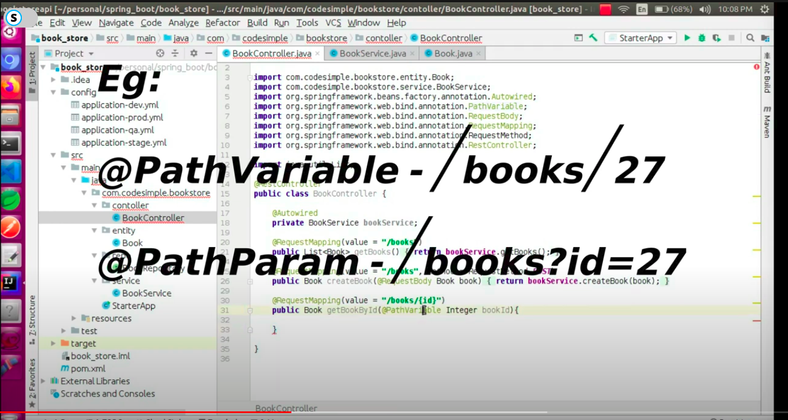

# Books_api

* Path Param vs Path Variable
  

Spring JPA Keywords:
find,
exists,
delete,
count

Terminating:
By,
And

IN:
findAllByBookTypeIn(Set<String> bookTypes)

IgnoreCase:
List<Book> findAllByBookTypeIgnoreCaseIn(Set<String> bookTypes)

And:
List<Book> findAllByBookTypeIgnoreCaseInAndYearOfPublication(Set<String> bookTypes, Integar yop)

NotIn:
findAllByBookTypeIgnoreCaseNotIn(Set<String> bookTypes)

Exists:
boolean existsByBookType(String bookTypes)

Examples:
findAllByBookTypeIn
findAllByBookTypeIgnoreCaseIn
findAllByBookTypeIgnoreCaseInAndYearOfPublication
findAllByBookTypeIgnoreCaseNotIn
existsByBookType
findOneByBookId
findOneByYearOfPublication
findOnlyOneByYearOfPublication
findAnythingByBookType